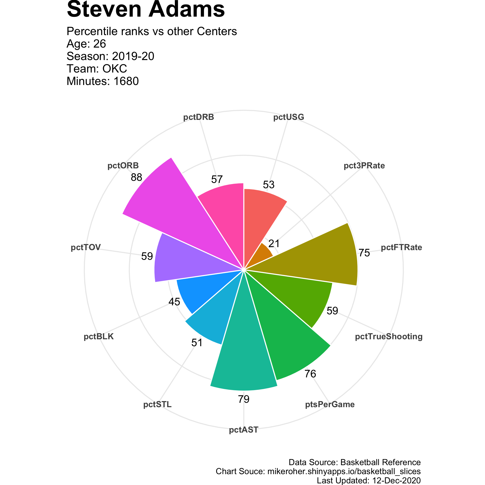

# Basketball Slices

https://mikeroher.shinyapps.io/basketball_slices/

## Introduction

> Summarize NBA player abilities with beautiful charts!    



The numbers shown are percentile ranks across position groups (Guards, Wings, Centers). They are not the pecentage values. This means a larger number indicates the player is better than his peers on a particular statistic. For example, Steven Adams has an 88 in pctORB (see below). This means he is 88th percentile among all centers at collecting available offensive rebounds.

The charts summarize a player's contributions across 11 dimensions:

| Category     | Statistic               | Abbeviation     | Explanation                                                                                                              |
|--------------|-------------------------|-----------------|--------------------------------------------------------------------------------------------------------------------------|
| Rebounding   | Offensive Rebounding Percentage  | pctORB          | An estimate of the percentage of available offensive rebounds a player grabbed while he was on the floor.                |
|              | Defensive Rebounding Percentage  | pctDB           | An estimate of the percentage of available defensive rebounds a player grabbed while he was on the floor.                |
| Scoring      | Usage Percentage                 | pctUSG          | An estimate of the percentage of team plays used by a player while he was on the floor.                                  |
|              | 3-Point Attempt Rate    | pct3PRate       | Percentage of FG Attempts from 3-Point Range                                                                             |
|              | Free Throw Attempt Rate | pctFTRate       | Number of FT Attempts Per FG Attempt                                                                                     |
|              | True Shooting Percentage         | pctTrueShooting | A measure of shooting efficiency that takes into account 2-point field goals, 3-point field goals, and free throws.      |
|              | Points per Game         | ptsPerGame      | Number of points scored per game.                                                                                        |
| Court Vision | Assist Percentage                | pctAst          | An estimate of the percentage of teammate field goals a player assisted while he was on the floor.                       |
|              | Turnover Percentage     | pctTOV          | An estimate of turnovers committed per 100 plays.                                                                        |
| Defense      | Steal Percentage        | pctSTL          | An estimate of the percentage of opponent possessions that end with a steal by the player while he was on the floor.     |
|              |  Block Percentage       | pctBLK          | An estimate of the percentage of opponent two-point field goal attempts blocked by the player while he was on the floor. |


## Usage

Run the shiny app by the following command:
```
R app.r
```

## R Package Dependencies

* devtools
* dplyr
* ggplot2
* nbastatR
* shiny
* stringr
* tidyr

